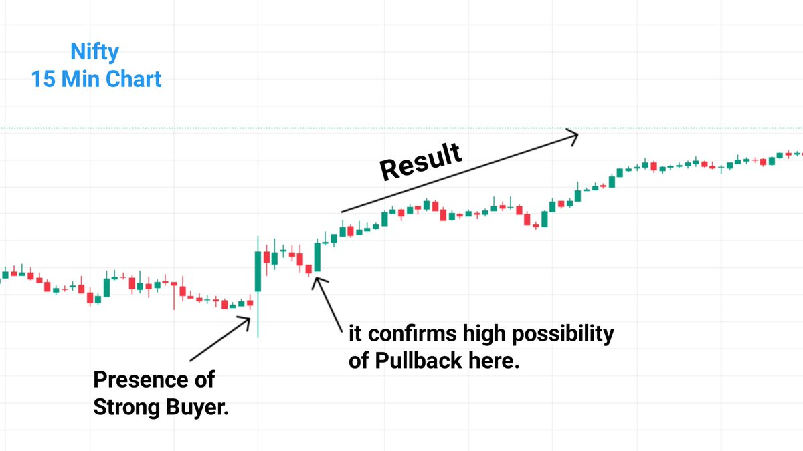
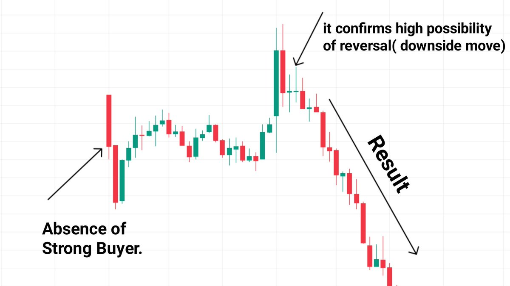
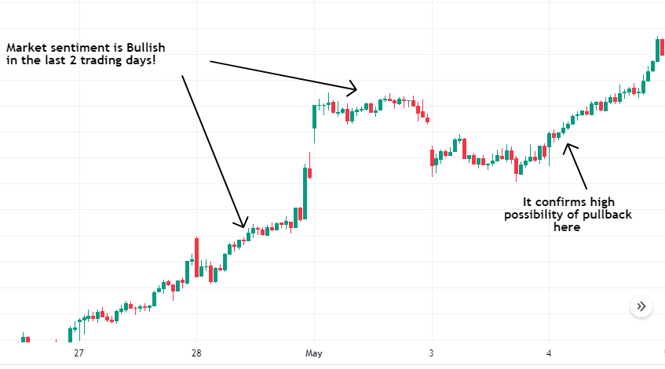
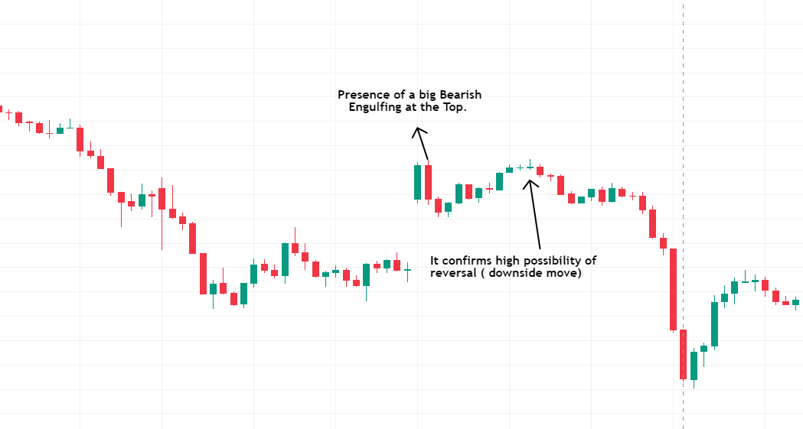
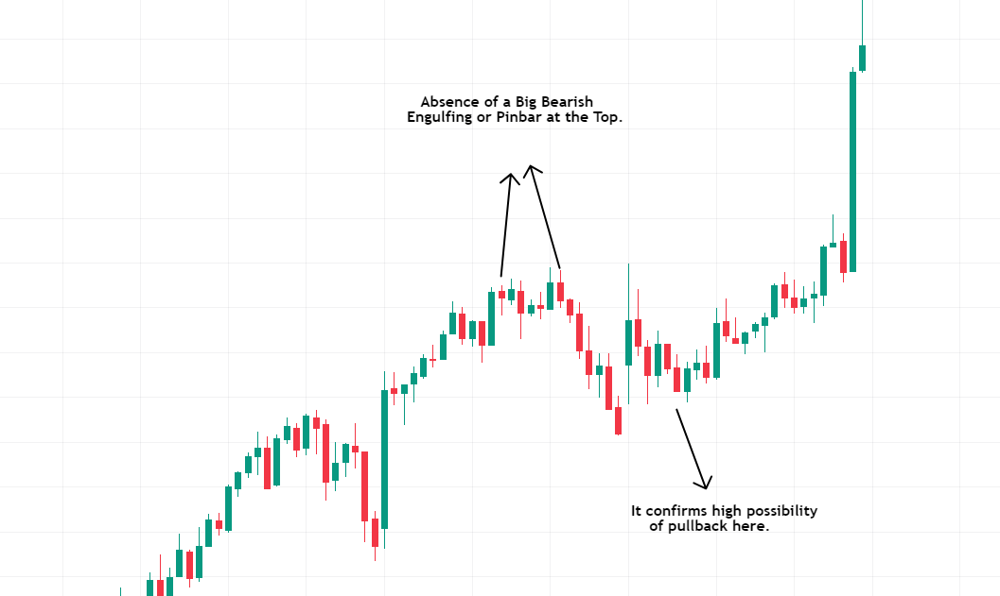
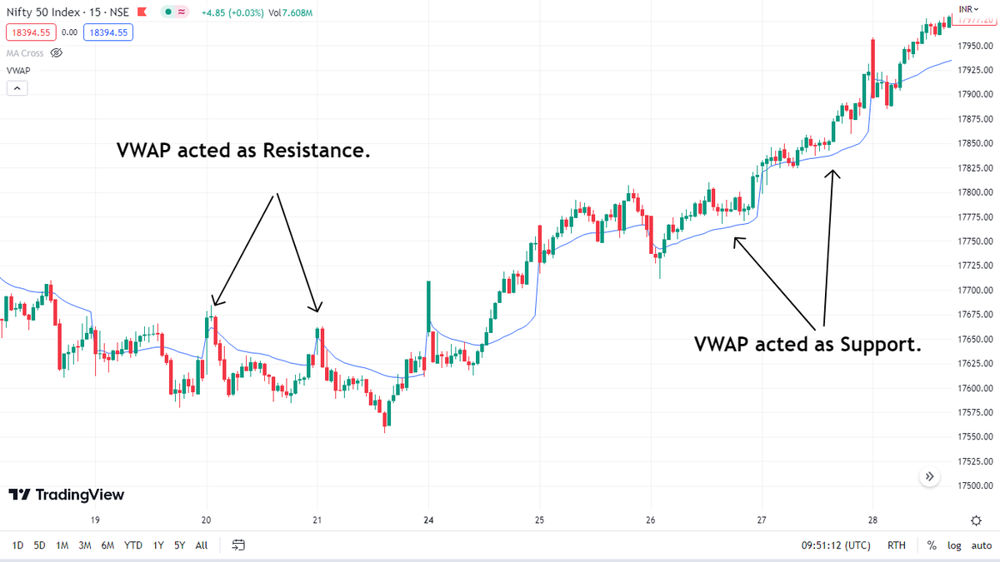
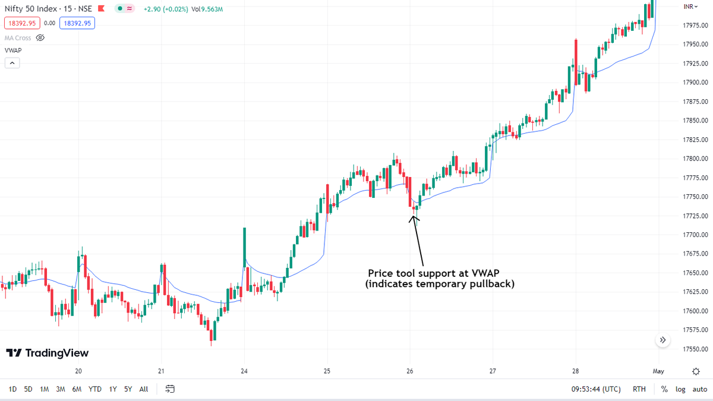

You take a Big Profit trade at open
Price moved upside, & you made some profits
After some time, the price started to come down
Now you don't know whether it is a **TEMPORARY PULLBACK or a COMPLETE REVERSAL**

### 1️⃣ Look at Open Action

Open action (9.15–9.45) plays a crucial role in the day.
The presence of strong buyers indicates it is just a pullback.
The absence of strong buyers indicates a high possibility of reversal!

### 2️⃣ Look at the Last 2 Days' Price Action

The last 2-3 days' market sentiment plays a crucial role in the current day.
If it is positive, then there is a high possibility that the price is just showing a temporary pullback (and not a complete reversal).

### 3️⃣ Look at the Candlestick

Usually, the price forms a "Big Bearish Engulfing" at the top before reversing.
The absence of such a candlestick pattern indicates it is just a pullback!

### 4️⃣ Look at VWAP

On most times VWAP acts as Support or Resistance.
If the price is taking support at VWAP, then it means a high possibility of temporary pullback (and not complete reversal).

